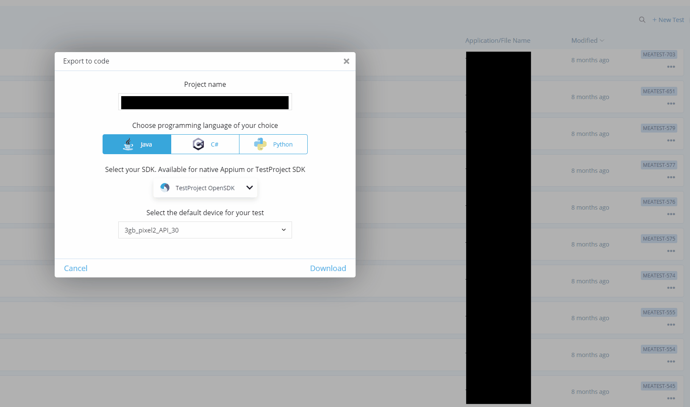

# Test Project Exit Tools #

This toolset is designed to aid in moving your work out of test project.

**Uses**: Python, Robotframework, and Selenium

Code written by: Gregory Fernandez

### Instructions: ###

Prerequisites:
* Python (3.x)
* Selenium webdriver for your browser downloaded and on **PATH**

1. Navigate to project root
2. Edit the **settings** file and fill in your username, password, preferred language, and preferred browser
3. Install project requirements: ```` python -m pip install -r Requirements.txt ````
4. Run the command: ```` python -m robot -A settings .````

### Notes:   ###
* Please note that as the program downloads tests, it will delete the test element from the page. It **is not deleting your actual tests** out of Test Project. If you refresh the page they will come back!

* I use windows and chrome. Unsure of how this will perform on other Operating Systems and Browsers.


